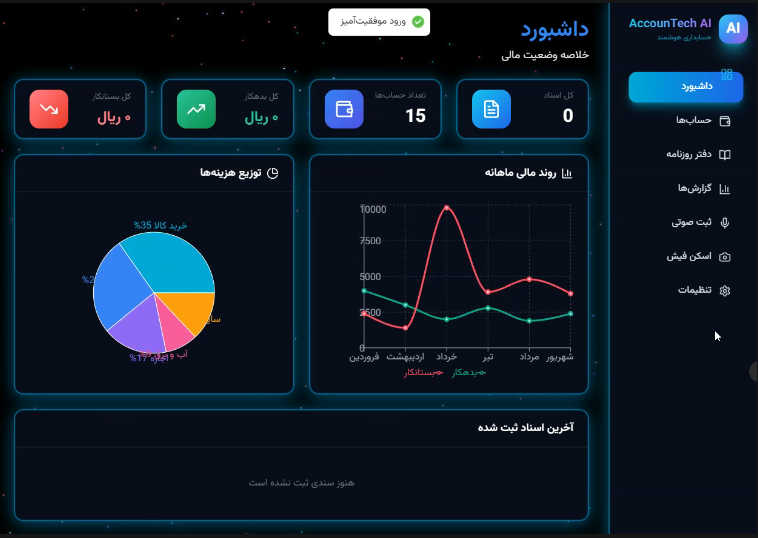
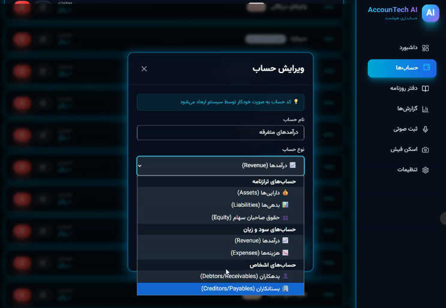
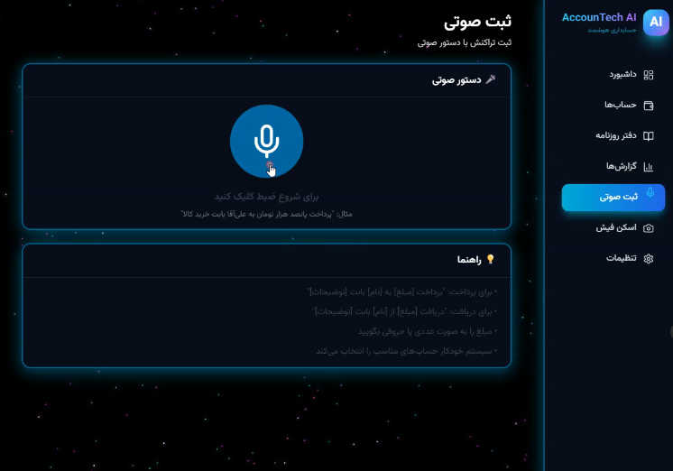
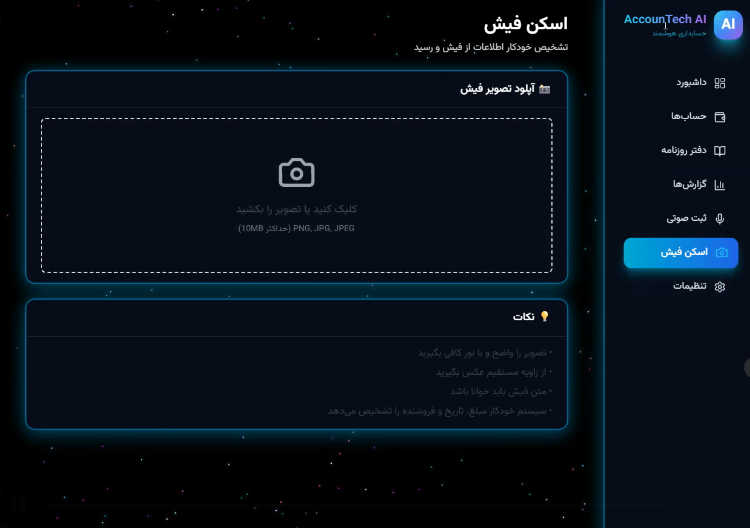
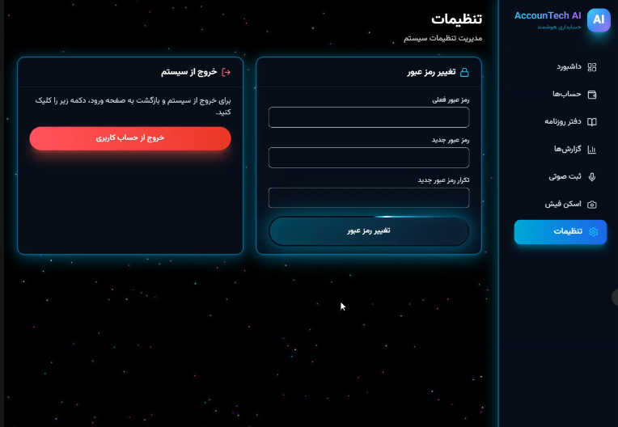

<div align="center">

# 💼 AccounTech AI

### سیستم حسابداری هوشمند با پردازش صوتی و OCR

[](https://www.python.org/downloads/)
[](https://fastapi.tiangolo.com/)
[](https://reactjs.org/)
[](https://www.typescriptlang.org/)
[](LICENSE)

**سیستم حسابداری حرفه‌ای با رابط کاربری مدرن، احراز هویت امن، پردازش صوتی فارسی، و OCR**

[امکانات](#-امکانات-اصلی) • [نصب](#-نصب-و-راه‌اندازی) • [استفاده](#-اولین-استفاده) • [مستندات](#-ساختار-پروژه)

</div>

---

## 📸 تصاویر پروژه

<div align="center">

### 🔐 صفحه ورود


### 📊 داشبورد


### 📁 مدیریت حساب‌ها




### 🎤 ثبت صوتی


### 📸 اسکن فیش (OCR)


### ⚙️ تنظیمات


</div>

---

## 🌟 ویژگی‌های برجسته

- 🎤 **ثبت صوتی هوشمند**: پردازش دستورات صوتی فارسی و تبدیل به سند حسابداری
- 📸 **OCR پیشرفته**: اسکن و استخراج اطلاعات از فیش‌ها و اسناد
- 🔐 **احراز هویت امن**: سیستم رمزنگاری SHA256 و مدیریت نشست
- 📊 **گزارش‌های تحلیلی**: داشبورد پیشرفته با نمودارها و آمار
- 🌳 **ساختار سلسله مراتبی**: مدیریت حساب‌ها با کدگذاری خودکار
- 🎨 **UI/UX مدرن**: طراحی Glassmorphism با انیمیشن‌های نرم

---

## ✨ امکانات اصلی

### 🔐 احراز هویت و امنیت
- ورود با رمز عبور (پیش‌فرض: `admin`)
- امکان تغییر رمز عبور از منوی تنظیمات
- محافظت تمام صفحات با Protected Routes
- ذخیره امن رمز عبور با SHA256 hash

### � مدیریت حساب‌ها
- **ساختار سلسله مراتبی کامل**: سرفصل → زیرمجموعه → زیرزیرمجموعه
- **کدگذاری خودکار**: سیستم به صورت هوشمند کد حساب می‌سازد
- **7 نوع حساب استاندارد**:
  - دارایی‌ها (Assets)
  - بدهی‌ها (Liabilities)
  - حقوق صاحبان سهام (Equity)
  - درآمدها (Revenue)
  - هزینه‌ها (Expenses)
  - بدهکاران (Debtors/Receivables)
  - بستانکاران (Creditors/Payables)
- نمایش درختی حساب‌ها با indent
- محافظت از حساب‌های سرفصل اصلی (غیرقابل ویرایش/حذف)
- جستجوی پیشرفته بر اساس نام یا کد

### 📝 دفتر روزنامه (Journal)
- ثبت اسناد حسابداری با تراکنش‌های دوطرفه
- **ثبت صوتی (Voice Entry)**: 
  - پشتیبانی کامل از زبان فارسی
  - تشخیص مبلغ، نوع تراکنش، و طرف حساب
  - تبدیل خودکار اعداد فارسی ("پانصد هزار تومان" → 5,000,000 ریال)
- **اسکن فیش (OCR Entry)**:
  - استخراج خودکار اطلاعات از تصاویر
  - پشتیبانی از فرمت‌های مختلف تصویر
- نمایش تراکنش‌ها با جزئیات کامل و فیلتر پیشرفته

### 📈 گزارش‌ها
- داشبورد با آمار کلی
- گزارش سود و زیان (در حال توسعه)
- ترازنامه (در حال توسعه)
- تراز آزمایشی (در حال توسعه)

### 🎨 رابط کاربری
- طراحی مدرن با XRayBox theme
- پس‌زمینه ستاره‌ای متحرک
- کارت‌های شیشه‌ای (Glassmorphism)
- رنگ‌بندی آبی فیروزه‌ای (Cyan)
- انیمیشن‌های نرم
- Responsive و Mobile-friendly

## 🛠️ تکنولوژی

### Backend
- **FastAPI** (Python 3.11+)
- **SQLAlchemy** ORM
- **SQLite** Database
- **Pydantic** Validation
- **SHA256** Password Hashing

### Frontend
- **React 18** + **TypeScript**
- **TailwindCSS** + Custom Styling
- **React Query** (TanStack Query)
- **React Router** v6
- **Lucide Icons**
- **React Hot Toast**

## 🚀 شروع سریع

### روش 1: استفاده از اسکریپت‌های خودکار (Windows)

```bash
# نصب و راه‌اندازی اولیه
INSTALL.bat

# اجرای همزمان Backend و Frontend
START_ALL.bat
```

### روش 2: نصب دستی

#### پیش‌نیازها
- Python 3.11 یا بالاتر
- Node.js 18 یا بالاتر
- npm یا yarn

### مرحله 1: Backend

```bash
# رفتن به پوشه backend
cd backend

# ایجاد محیط مجازی
python -m venv venv

# فعال‌سازی محیط مجازی
# Windows:
venv\Scripts\activate
# Linux/Mac:
source venv/bin/activate

# نصب پکیج‌ها
pip install -r requirements.txt

# ایجاد دیتابیس و حساب‌های پیش‌فرض
python init_db.py

# اجرای سرور
uvicorn main:app --reload --host 0.0.0.0 --port 8000
```

### مرحله 2: Frontend

```bash
# رفتن به پوشه frontend
cd frontend

# نصب پکیج‌ها
npm install

# اجرای سرور توسعه
npm run dev
```

### مرحله 3: دسترسی

- **Frontend**: http://localhost:5173
- **Backend API**: http://localhost:8000
- **API Docs**: http://localhost:8000/docs

## � اولین استفاده

1. **ورود به سیستم**:
   - مراجعه به http://localhost:5173
   - رمز عبور پیش‌فرض: `admin`
   - وارد شوید

2. **تغییر رمز عبور** (توصیه می‌شود):
   - از منوی سایدبار، روی **تنظیمات** کلیک کنید
   - رمز فعلی: `admin`
   - رمز جدید: رمز دلخواه خود
   - ذخیره کنید

3. **ایجاد حساب جدید**:
   - از منو، روی **حساب‌ها** کلیک کنید
   - دکمه **حساب جدید** را بزنید
   - نام حساب را وارد کنید (مثلاً "بانک ملی")
   - نوع حساب را انتخاب کنید (مثلاً "دارایی‌ها")
   - سرفصل را انتخاب کنید (مثلاً "دارایی‌های جاری")
   - کد حساب **خودکار** ساخته می‌شود!

4. **ثبت سند**:
   - از منو، روی **دفتر روزنامه** کلیک کنید
   - دکمه **سند جدید** را بزنید
   - گزینه **ثبت صوتی** یا **اسکن فیش** را انتخاب کنید

## 📂 ساختار پروژه

```
ACCOUNTING/
├── backend/
│   ├── routers/          # API endpoints
│   │   ├── accounts.py   # مدیریت حساب‌ها
│   │   ├── auth.py       # احراز هویت
│   │   ├── journal.py    # دفتر روزنامه
│   │   ├── reports.py    # گزارش‌ها
│   │   ├── voice.py      # ثبت صوتی
│   │   └── ocr.py        # اسکن فیش
│   ├── models.py         # مدل‌های دیتابیس
│   ├── schemas.py        # Pydantic schemas
│   ├── database.py       # تنظیمات دیتابیس
│   ├── init_db.py        # راه‌اندازی اولیه
│   ├── main.py           # Entry point
│   └── requirements.txt  # پکیج‌های Python
│
└── frontend/
    ├── src/
    │   ├── components/   # کامپوننت‌های قابل استفاده مجدد
    │   ├── pages/        # صفحات اصلی
    │   │   ├── Login.tsx
    │   │   ├── Dashboard.tsx
    │   │   ├── Accounts.tsx
    │   │   ├── Journal.tsx
    │   │   ├── Settings.tsx
    │   │   └── ...
    │   ├── lib/          # توابع کمکی
    │   ├── App.tsx       # Root component
    │   └── main.tsx      # Entry point
    └── package.json      # پکیج‌های npm
```

## 🎯 حساب‌های پیش‌فرض

سیستم با ساختار کامل حساب‌های استاندارد راه‌اندازی می‌شود:

```
1. دارایی‌ها
   ├─ 11. دارایی‌های جاری
   │   ├─ 111. صندوق
   │   ├─ 112. بانک
   │   └─ 113. موجودی کالا
   └─ 12. دارایی‌های ثابت
       ├─ 121. ساختمان
       └─ 122. ماشین‌آلات

2. بدهی‌ها
   ├─ 21. بدهی‌های جاری
   └─ 22. بدهی‌های بلندمدت

3. حقوق صاحبان سهام
   ├─ 31. سرمایه
   └─ 32. سود انباشته

4. درآمدها
   ├─ 41. درآمد فروش
   └─ 42. سایر درآمدها

5. هزینه‌ها
   ├─ 51. هزینه‌های عملیاتی
   │   ├─ 511. حقوق و دستمزد
   │   ├─ 512. اجاره
   │   ├─ 513. آب و برق و گاز
   │   └─ 514. تلفن و اینترنت
   └─ 52. هزینه‌های اداری
       ├─ 521. لوازم اداری
       └─ 522. هزینه تبلیغات

6. بدهکاران
   ├─ 61. مشتریان
   └─ 62. اسناد دریافتنی

7. بستانکاران
   ├─ 71. تامین‌کنندگان
   └─ 72. اسناد پرداختنی
```

## 🔧 تنظیمات پیشرفته

### تغییر پورت Backend
در فایل `backend/main.py` یا هنگام اجرا:
```bash
uvicorn main:app --port 8080
```

### تغییر پورت Frontend
در فایل `frontend/vite.config.ts`:
```typescript
export default defineConfig({
  server: {
    port: 3000
  }
})
```

### Build برای Production

**Frontend**:
```bash
cd frontend
npm run build
```
فایل‌های build شده در پوشه `dist/` قرار می‌گیرند.

**Backend**:
```bash
cd backend
uvicorn main:app --host 0.0.0.0 --port 8000
```

## � رفع مشکلات رایج

### خطای "Cannot find module '@tanstack/react-query'"
```bash
cd frontend
npm install @tanstack/react-query
```

### خطای "Module not found: routers"
مطمئن شوید که در پوشه `backend` هستید و `uvicorn` را اجرا کرده‌اید.

### دیتابیس خالی است
```bash
cd backend
python init_db.py
```

### رمز عبور را فراموش کرده‌ام
فایل `backend/app_password.txt` را حذف کنید. رمز به `admin` ریست می‌شود.

## 📝 توسعه آینده

- [ ] گزارش سود و زیان با تفکیک کامل
- [ ] ترازنامه با دسته‌بندی
- [ ] تراز آزمایشی
- [ ] Export به Excel/PDF
- [ ] پشتیبان‌گیری خودکار
- [ ] چند کاربره (Multi-user)
- [ ] نمودارهای تحلیلی پیشرفته

## 🐳 دیپلوی با Docker

```bash
# Build و اجرای کانتینرها
docker-compose up -d

# مشاهده لاگ‌ها
docker-compose logs -f

# توقف سرویس‌ها
docker-compose down
```

**دیپلوی Production با SSL**:
```bash
# استفاده از docker-compose.prod.yml
docker-compose -f docker-compose.prod.yml up -d
```

گواهی SSL به صورت خودکار توسط Let's Encrypt صادر می‌شود.

---

## 🌐 دیپلوی روی Netlify

برای دیپلوی Frontend روی Netlify:

1. فایل‌های `frontend/dist` را build کنید
2. به https://app.netlify.com/drop بروید
3. پوشه `dist` را drag & drop کنید

مستندات کامل: [NETLIFY_DEPLOY.md](NETLIFY_DEPLOY.md)

---

## 📚 مستندات بیشتر

- [📖 راهنمای نصب سریع](QUICK_START.md)
- [🚀 راهنمای دیپلوی](DEPLOYMENT_GUIDE.md)
- [🔐 تنظیم SSL](NETLIFY_SSL_SETUP.md)
- [💻 راهنمای GitHub](GITHUB_SETUP.md)

---

## 🤝 مشارکت

مشارکت شما در بهبود این پروژه استقبال می‌شود!

1. Fork کنید
2. برنچ جدید بسازید (`git checkout -b feature/AmazingFeature`)
3. تغییرات را commit کنید (`git commit -m 'Add some AmazingFeature'`)
4. Push کنید (`git push origin feature/AmazingFeature`)
5. Pull Request باز کنید

---

## 📄 مجوز

MIT License - برای جزئیات بیشتر فایل [LICENSE](LICENSE) را مشاهده کنید.

---

## 👨‍💻 توسعه‌دهنده

**AccounTech AI Development Team**

- 📧 Email: mahmoudmahami@gmail.com
- 🌐 Website: [etherium.group](https://etherium.group)
- 💼 GitHub: [@Mahaaam](https://github.com/Mahaaam)

---

## 📊 آمار پروژه

- **خطوط کد**: 11,300+
- **فایل‌ها**: 65+
- **زبان‌ها**: Python, TypeScript, JavaScript
- **Framework‌ها**: FastAPI, React
- **نسخه**: 1.0.0
- **تاریخ انتشار**: دی ۱۴۰۴ / ژانویه ۲۰۲۶

---

<div align="center">

### ⭐ اگر این پروژه برایتان مفید بود، یک ستاره بدهید!

**ساخته شده با ❤️ در ایران**

</div>
